# lab2-sql-murder-IsabellaSanchezMejia


<div>
  
</div>


<br><br>
## Datos

* **Detective:** Isabella Sánchez Mejía
* **Correo:** isabella.smejia@udea.edu.co

<br><br>
## Resumen del caso

El 15 de enero de 2018, en SQL City, ocurrió un asesinato que quedó registrado en la base de datos del departamento de policía. A partir de los reportes del crimen, las entrevistas a testigos y la información almacenada en diferentes tablas de la base de datos. La investigación permitió determinar que el asesino fue Jeremy Bowers. Sin embargo, a partir de su declaración también se descubrió que él no actuó por iniciativa propia, sino que fue contratado por Miranda Priestly, quien resultó ser la autora intelectual detrás del crimen.
<br><br>
## Bitácora de investigación

### Reporte del crimen

Para resolver este caso, partí de la información inicial que ya se conoce: la fecha del crimen, el 15 de enero de 2018, y la ciudad donde ocurrió, SQL City. Con estos datos iniciales, realicé una búsqueda en la base de datos para encontrar el reporte correspondiente a la escena del crimen.

En esta consulta filtré los registros que coincidieran con la fecha indicada, la ciudad y el tipo de delito, que en este caso es asesinato. De esta manera, pude identificar el informe específico del crimen.

```sql
SELECT * FROM crime_scene_report WHERE date is 20180115 AND 
city = "SQL City" AND type= "murder"
```       

Después de ejecutar la consulta, obtuve información sobre dos posibles testigos relacionados con el caso. El primer testigo vive en la última casa de Northwestern Dr. El segundo testigo es una mujer llamada Annabel, quien reside en algún lugar de Franklin Ave.

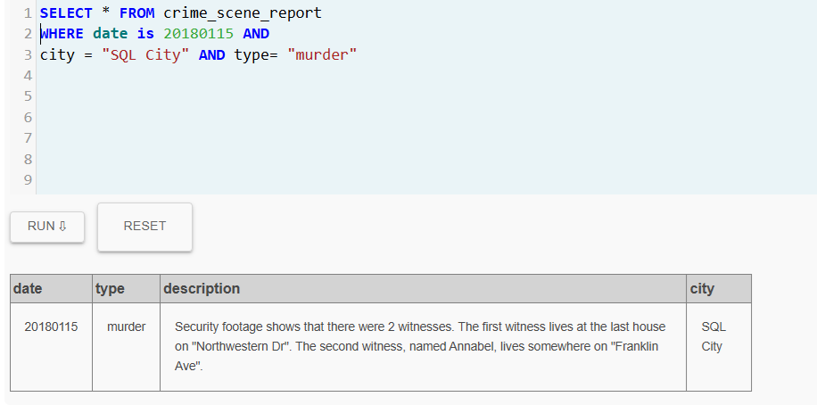
<br><br>
### Primer testigo

Teniendo en cuenta al primer testigo, la única información disponible es que vive en la última casa de Northwestern Dr. A partir de esta pista, realicé una consulta en la que ordené los registros de las direcciones de esa calle en orden descendente, con el fin de identificar la casa con el número más alto (correspondiente a la última casa)


```sql
SELECT * FROM person
WHERE address_street_name is "Northwestern Dr"
ORDER BY address_number	DESC
LIMIT 1;
```      
 De esta manera, pude obtener los datos de la persona que reside en esa vivienda (Morty Schapiro) y continuar con el rastreo de nuevas pistas.

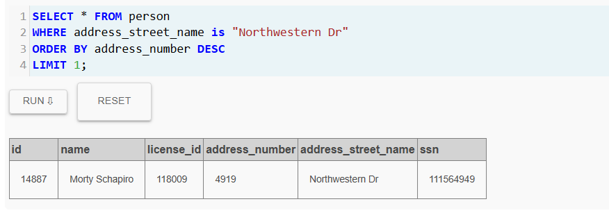
<br><br>
### Segundo testigo

Para el segundo testigo, contaba con información sobre su nombre y la calle donde vive. Con estos datos, realicé una consulta filtrando los registros por el nombre Annabel y por la calle Franklin Ave. 

```sql
SELECT  * FROM person
WHERE name LIKE "%Annabel%"
AND address_street_name is "Franklin Ave" 
```
De esta manera, pude obtener los datos completos de esta persona y continuar con el análisis de la información disponible.

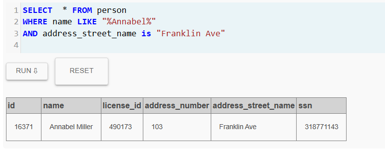
<br><br>
### Entrevistando a los dos sospechosos

Una vez obtenida la información de ambos individuos, procedí a consultar sus declaraciones registradas en la base de datos. Para ello, realicé un JOIN entre las tablas de personas y entrevistas, lo que me permitió obtener el nombre de cada individuo junto con el contenido de su declaración. 

```sql
SELECT person.name,interview.transcript FROM person
JOIN interview ON person.id = interview.person_id
WHERE person_id is 16371 OR person_id is 14887
```

Con esta nueva información, obtuve más pistas a partir de sus testimonios, lo que me permitió continuar avanzando en la investigación mediante el análisis de los datos disponibles.

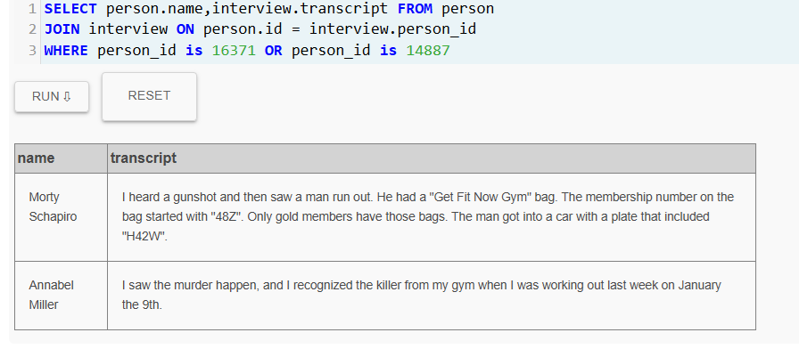
<br><br>
###Siguiendo pistas de las entrevistas

#### Pista 1

La primera pista se obtiene a partir de la declaración de Morty, quien afirmó haber visto a un hombre salir corriendo del lugar con un bolso del gimnasio Get Fit Now Gym. Según su testimonio, únicamente los miembros con estatus gold reciben ese tipo de bolso.

Con base en esta información, realicé una consulta para buscar en la base de datos a los miembros del gimnasio que tienen estatus gold y cuyo identificador coincide con el patrón mencionado en la pista. La consulta utilizada fue la siguiente:

```sql
SELECT * FROM get_fit_now_member 
WHERE membership_status = "gold" AND id LIKE "%48%"
```
Los resultados de esta consulta mostraron dos posibles sospechosos que cumplen con estas características.

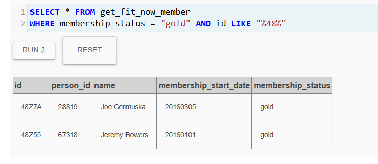

#### Pista 2

Además de la información anterior, en la declaración también se mencionaba que el sospechoso huyó en un automóvil cuya placa contenía la secuencia H42W. Con esta nueva pista, realicé una búsqueda en la tabla de licencias de conducir para identificar a las personas cuyo vehículo tuviera una placa que coincidiera con esa secuencia.

```sql
SELECT * FROM drivers_license
WHERE plate_number LIKE "%H42W%";
```

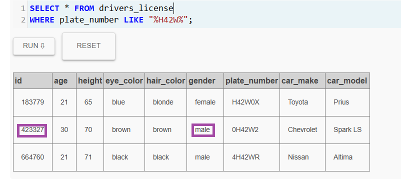

<br><br>
###Siguiendo al sospechoso

#### Prueba 1

Con base en la información recolectada anteriormente, ya se sabía que el sospechoso era un hombre. Por esta razón, descarté a las dos mujeres que aparecían en los resultados y me quedé únicamente con el sospechoso restante, quien posee el identificador de licencia de conducción 423327.

```sql
SELECT * FROM person WHERE license_id = 423327
```

A partir de este dato, realicé una búsqueda utilizando ese identificador en la tabla person para obtener la información correspondiente a esta persona y así continuar con el proceso de investigación. El sospechoso es Jeremy Bowers.

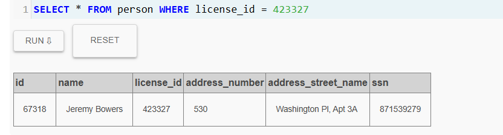

#### Prueba 2

Hasta este momento tenía un sospechoso principal, por lo que necesitaba obtener otra prueba que confirmara si realmente había estado involucrado en el crimen. Para ello, retomé uno de los testimonios, en el cual se mencionaba que el asesino tenía un estatus gold en el gimnasio Get Fit Now Gym.

Con esta pista, consulté la tabla get_fit_now_member y busqué a la persona utilizando su identificador correspondiente.

```sql
SELECT * FROM get_fit_now_member WHERE person_id = 67318
```


Los resultados de la consulta confirmaron que este individuo posee un estatus gold en el gimnasio, lo que coincide con la descripción proporcionada por el testigo y fortalece la sospecha de que podría estar involucrado en el crimen. 

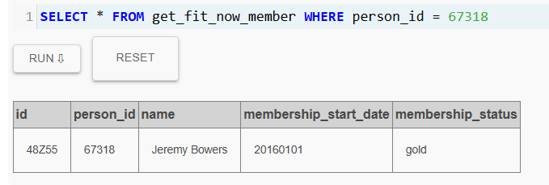
<br><br>
###¡Encontré al asesino!

Con esta información, decidí verificar si mi hipótesis era correcta y confirmar si esta persona era realmente la responsable del crimen.

```sql
INSERT INTO solution VALUES (1, 'Jeremy Bowers');
        SELECT value FROM solution;
```
En efecto, el asesino es Jeremy Bowers.

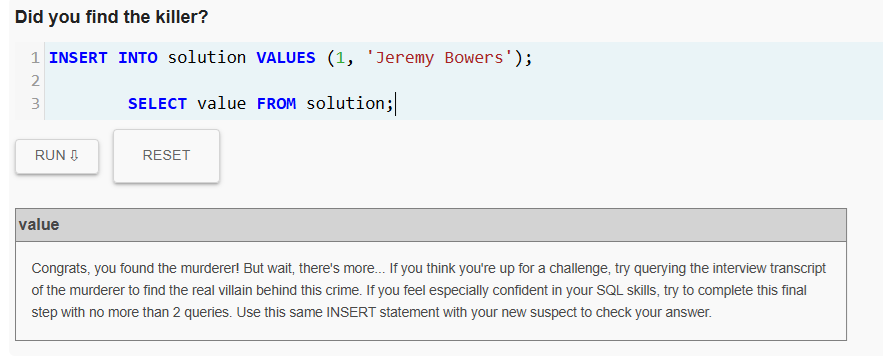

---
<br><br>

### Hay una parte 2

Ahora me falta llegar al asesino intelectual, quien es el verdadero villano detrás de este crimen.
<br><br>
###Entrevistando al asesino

Para conocer más detalles sobre los hechos, consulté la tabla interview con el fin de obtener la declaración del sospechoso. Para ello, realicé una búsqueda utilizando su identificador correspondiente, lo que me permitió acceder a su testimonio y analizar la información proporcionada para continuar con la investigación

```sql
SELECT * FROM interview WHERE person_id = 67318
```

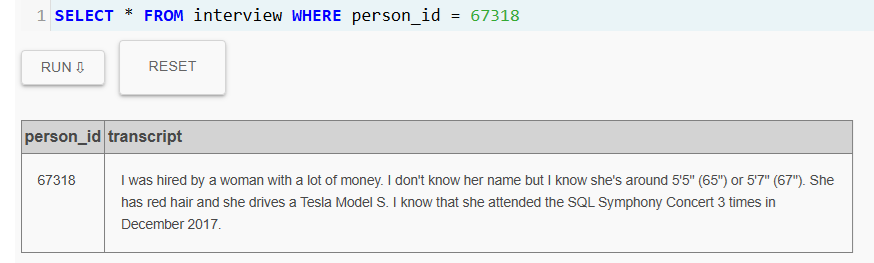

 De acuerdo con el testimonio, se mencionan las siguientes características:

- Tiene una estatura aproximada entre 65 y 67 pulgadas.

- Tiene cabello rojo.

- Conduce un Tesla Model S.

- Asistió al concierto SQL Symphony Concert tres veces durante diciembre de 2017.
<br><br>
### Encontrando al asesino intelectual

Con las pistas obtenidas anteriormente, decidí realizar una consulta que combinara toda la información disponible para identificar a la persona que cumpliera con todas las características mencionadas en la declaración. Para ello, utilicé las tablas drivers_license, person e income, las cuales uní mediante operaciones JOIN con el fin de relacionar la información de la licencia de conducción, los datos personales y los ingresos de cada individuo.

Posteriormente, apliqué varios filtros  teniendo en cuenta las características proporcionadas en el testimonio: que la persona fuera mujer, tuviera cabello rojo, midiera entre 65 y 67 pulgadas y condujera un Tesla Model S.

Además, agregué una subconsulta para verificar que la persona también hubiera asistido tres veces al concierto SQL Symphony Concert en diciembre de 2017. 


```sql
SELECT *
FROM drivers_license
JOIN person 
ON drivers_license.id = person.license_id
JOIN income 
ON person.ssn = income.ssn
WHERE drivers_license.car_model = 'Model S'
AND drivers_license.gender = 'female'
AND drivers_license.hair_color = 'red'
AND drivers_license.height BETWEEN 65 AND 67
AND person.id IN (
    SELECT person_id
    FROM facebook_event_checkin
    WHERE event_name = 'SQL Symphony Concert'
    GROUP BY person_id
    HAVING COUNT(*) = 3
);
```

De esta manera, logré filtrar los registros y obtener únicamente a la persona que cumplía con todas las pistas simultáneamente.

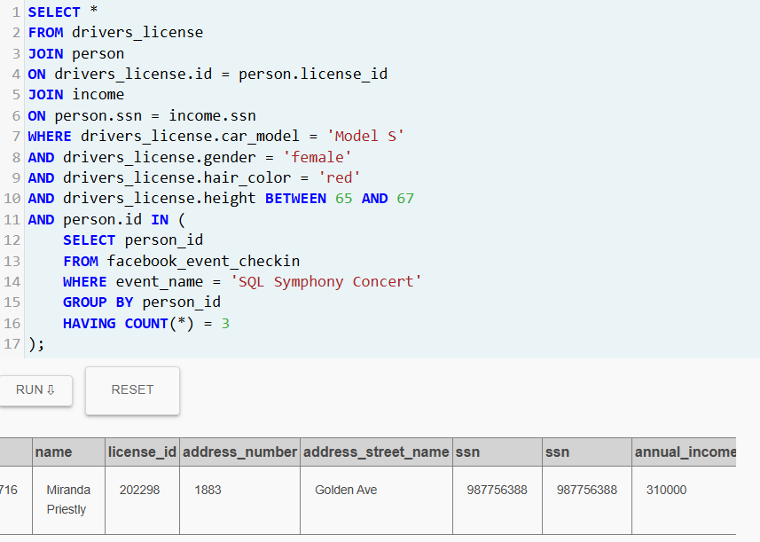
<br><br>
### Resultado Final


```sql
INSERT INTO solution VALUES (1, 'Miranda Priestly');
        
        SELECT value FROM solution;
```

Finalmente, comprobé la respuesta obtenida y confirmé que Miranda Priestly es la persona que se encuentra detrás del crimen.

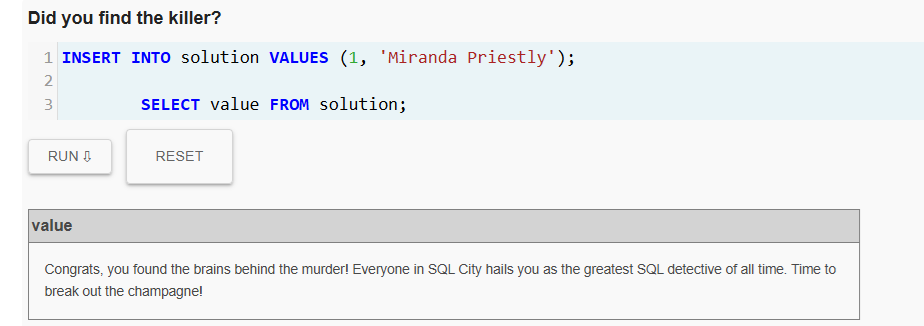

<br><br>

<div>
  
</div>
